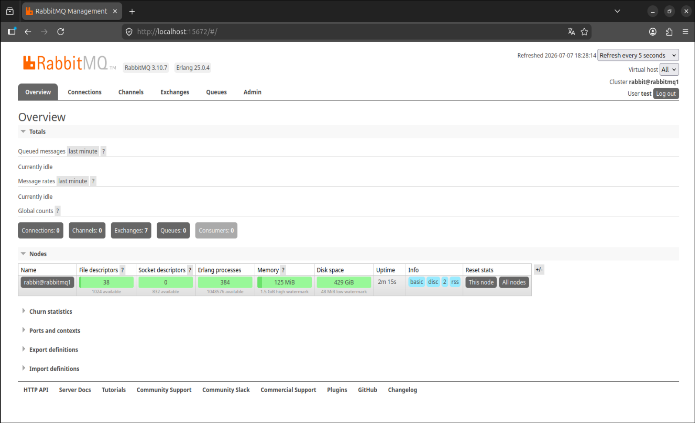
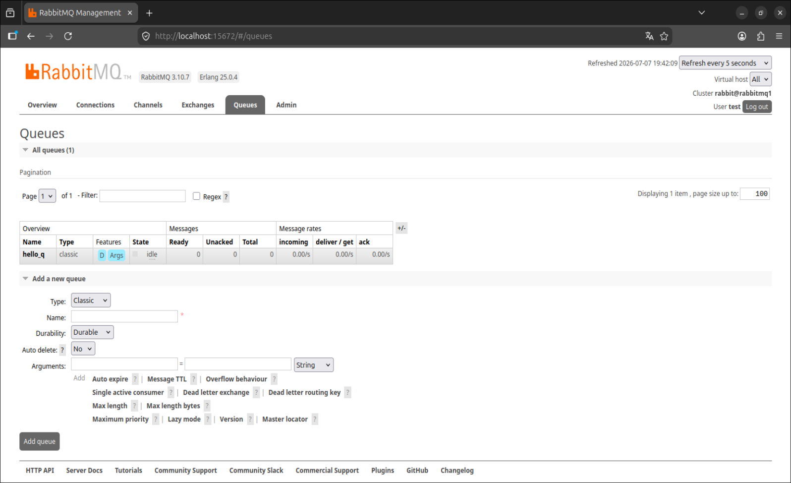
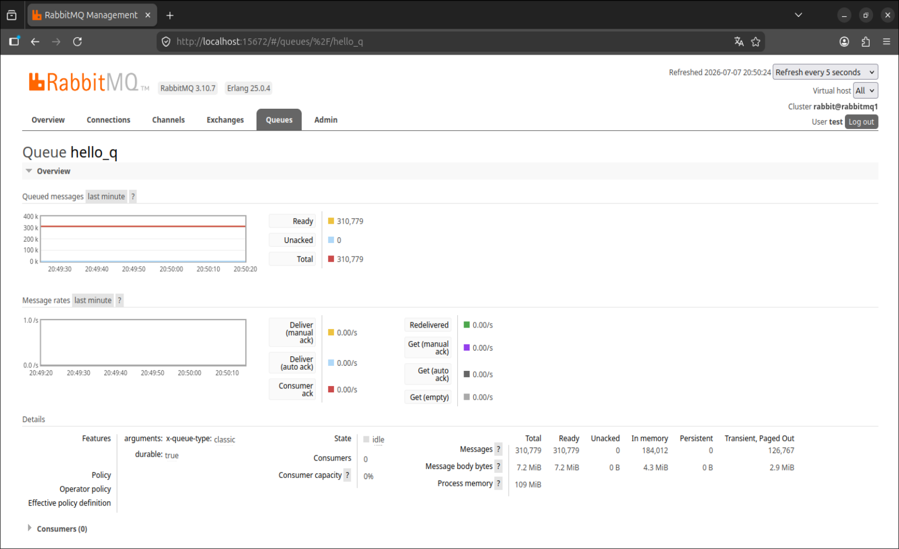
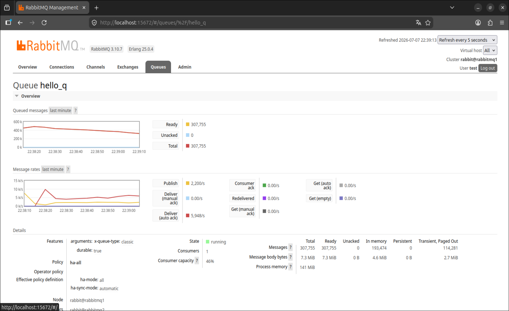
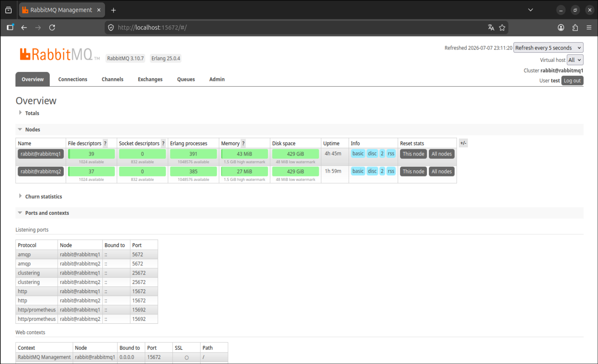
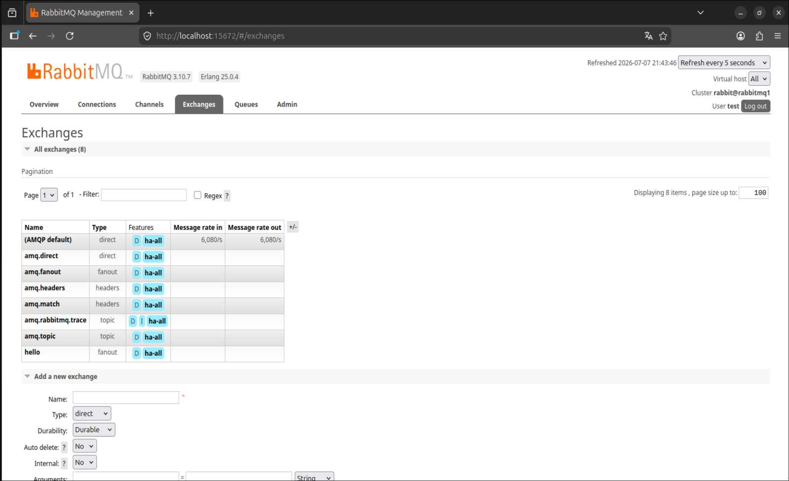
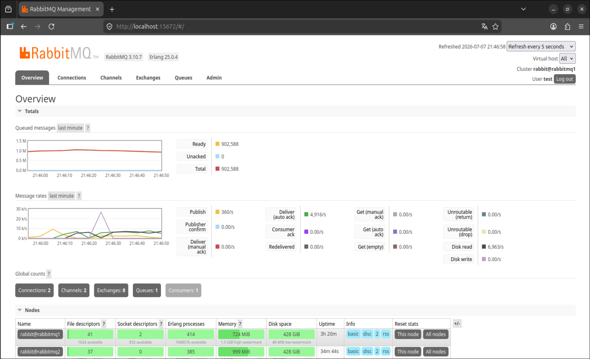

# Домашнее задание к занятию "Очереди RabbitMQ" - Валик Александр


### Задание 1

1. В контейнере запущен RabbitMQ-management, выполнен вход в веб-интерфейс.



 ---

### Задание 2

1. В веб-интерфейсе создана очередь hello_q.



2. Для отправки сообщений запущен скрипт producer.py.



3. Запущен скрипт consumer.py.



 ---

### Задание 3

1. Запущен контейнер со вторым экземпляром RabbitMQ, так как аппаратные возможности используемого ПК не позволяют запустить две виртуальных машины. Контейнеры объединены в кластер.




Создана политика ha-all на все очереди.




Вывод команды:
```bash
$ docker exec rabbitmq-rabbitmq1-1 rabbitmqctl cluster_status
```
<details>
<summary>Вывод (развернуть)</summary>
Cluster status of node rabbit@rabbitmq1 ...
Basics

Cluster name: rabbit@rabbitmq1

Disk Nodes

rabbit@rabbitmq1
rabbit@rabbitmq2

Running Nodes

rabbit@rabbitmq1
rabbit@rabbitmq2

Versions

rabbit@rabbitmq1: RabbitMQ 3.10.7 on Erlang 25.0.4
rabbit@rabbitmq2: RabbitMQ 3.10.7 on Erlang 25.0.4

Maintenance status

Node: rabbit@rabbitmq1, status: not under maintenance
Node: rabbit@rabbitmq2, status: not under maintenance

Alarms

(none)

Network Partitions

(none)

Listeners

Node: rabbit@rabbitmq1, interface: [::], port: 15672, protocol: http, purpose: HTTP API
Node: rabbit@rabbitmq1, interface: [::], port: 15692, protocol: http/prometheus, purpose: Prometheus exporter API over HTTP
Node: rabbit@rabbitmq1, interface: [::], port: 25672, protocol: clustering, purpose: inter-node and CLI tool communication
Node: rabbit@rabbitmq1, interface: [::], port: 5672, protocol: amqp, purpose: AMQP 0-9-1 and AMQP 1.0
Node: rabbit@rabbitmq2, interface: [::], port: 15672, protocol: http, purpose: HTTP API
Node: rabbit@rabbitmq2, interface: [::], port: 15692, protocol: http/prometheus, purpose: Prometheus exporter API over HTTP
Node: rabbit@rabbitmq2, interface: [::], port: 25672, protocol: clustering, purpose: inter-node and CLI tool communication
Node: rabbit@rabbitmq2, interface: [::], port: 5672, protocol: amqp, purpose: AMQP 0-9-1 and AMQP 1.0

Feature flags

Flag: classic_mirrored_queue_version, state: enabled
Flag: drop_unroutable_metric, state: enabled
Flag: empty_basic_get_metric, state: enabled
Flag: implicit_default_bindings, state: enabled
Flag: maintenance_mode_status, state: enabled
Flag: quorum_queue, state: enabled
Flag: stream_queue, state: enabled
Flag: user_limits, state: enabled
Flag: virtual_host_metadata, state: enabled
</details>

<br>
Скриншот выполнения команды

```bash
$ rabbitmqadmin get queue='hello'
```



<br>
Работа кластера RabbitMQ


